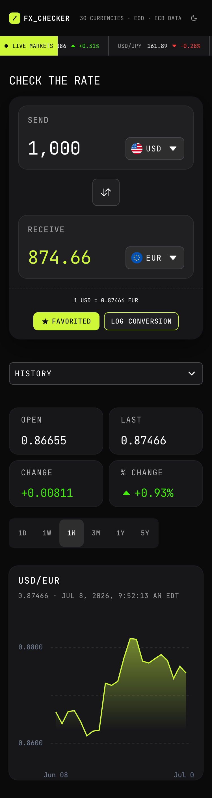
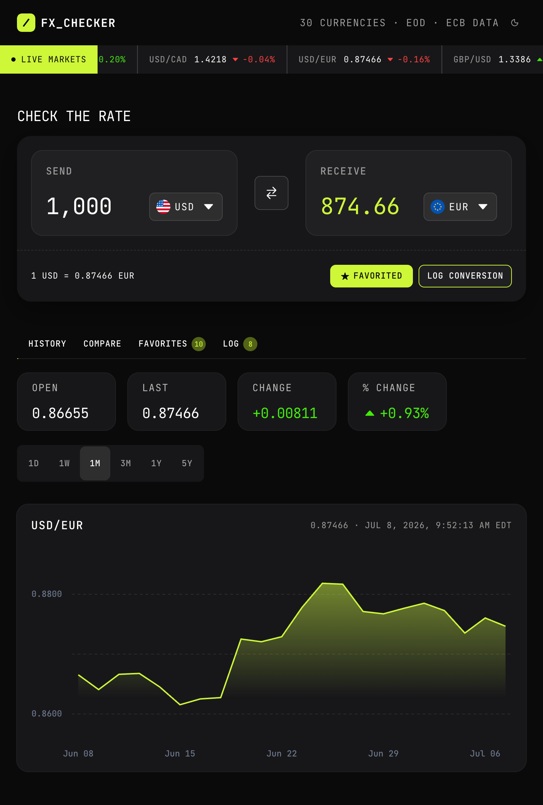
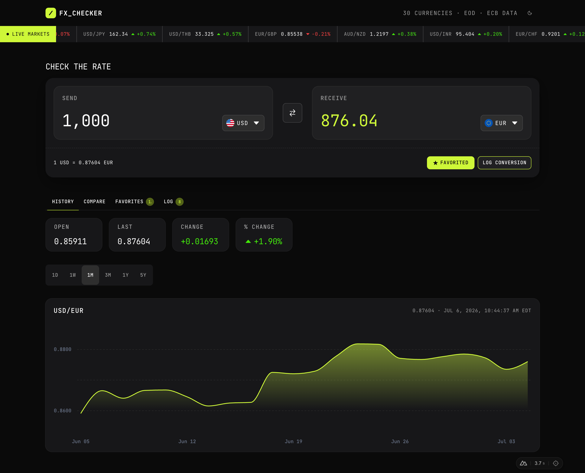

# Frontend Mentor - FX Checker solution

This is a solution to the [FX Checker challenge on Frontend Mentor](https://www.frontendmentor.io/challenges/foreign-exchange-currency-converter). Frontend Mentor challenges help you improve your coding skills by building realistic projects.

## Table of contents

- [Overview](#overview)
  - [The challenge](#the-challenge)
  - [Screenshots](#screenshots)
  - [Links](#links)
- [My process](#my-process)
  - [Built with](#built-with)
  - [What I learned](#what-i-learned)
  - [Continued development](#continued-development)
  - [Useful resources](#useful-resources)
  - [AI Collaboration](#ai-collaboration)
- [Author](#author)

## Overview

### The challenge

Your users should be able to:

#### Converter

- Enter an amount to send and see it convert in real time as they type
- Pick the "send" and "receive" currencies from a searchable currency picker
- See the live exchange rate for the active pair (for example, `1 USD = 0.8530 EUR`)
- Swap the send and receive currencies with the swap button
- Favorite the active pair, and log a conversion to their history

#### Currency picker

- Search the full list of available currencies by code or name
- See currencies grouped into "Popular" and "Other currencies", each row showing the flag, code, and name
- See a check against the currency that's currently selected

#### Live markets ticker

- See a ticker of currency pairs, each with its current rate and 24-hour change (up or down)

#### Rate history

- View a line and area chart of the active pair's rate over time
- Switch the chart range between 1D, 1W, 1M, 3M, 1Y, and 5Y
- See the open, last, absolute change, and percentage change for the selected range

#### Compare

- See their send amount converted into a range of other currencies at once, each with its reference rate
- Pin or unpin any comparison row to their favorites

#### Favorites

- See their pinned pairs, each with its live rate and 24-hour change
- Load a pinned pair back into the converter by selecting its row
- Unpin a pair they no longer want to track

#### Conversion log

- See a log of conversions they've made, each showing the relative time, the pair, and the send and receive amounts
- Clear the whole log
- Delete an individual entry

#### UI & accessibility

- View the optimal layout for the interface depending on their device's screen size
- See hover and focus states for all interactive elements on the page
- Navigate the entire app using only their keyboard

### Screenshots

|                     Mobile designed at 375px:                     |                    Tablet designed at 1440px:                     | Desktop designed at 1440px:                                         |
| :---------------------------------------------------------------: | :---------------------------------------------------------------: | ------------------------------------------------------------------- |
|  |  |  |

### Links

- Solution URL: [https://github.com/elisilk/foreign-exchange-checker](https://github.com/elisilk/foreign-exchange-checker)
- Live Site URL: [https://foreign-exchange-checker-seven.vercel.app/](https://foreign-exchange-checker-seven.vercel.app/)

## My process

### Built with

- [GitHub](https://github.com/) - code repository
- [Nuxt](https://nuxt.com/) - full-stack web framework (built on Vue, Vite, and Nitro)
- [Vercel](https://vercel.com/) - web host deployment
- [Pinia](https://pinia.vuejs.org/) - state management
  - [Pinia Plugin Persistedstate](https://prazdevs.github.io/pinia-plugin-persistedstate/) - persistent state storage
- [Nuxt UI](https://ui.nuxt.com/) - UI components (built on [Tailwind CSS](https://tailwindcss.com/) and [Reka UI](https://reka-ui.com/)), including icons, fonts, and color mode
  - [Nuxt Icon](https://nuxt.com/modules/icon)
    - [IonIcons](https://icones.js.org/collection/ion)
    - [Circle Flags](https://icones.js.org/collection/circle-flags)
  - [Nuxt Charts](https://nuxtcharts.com/) - for the history chart

For the workflow setup:

- [Husky](https://github.com/typicode/husky) and [Lint-staged](https://github.com/lint-staged/lint-staged) - for the pre-commit eslint setup
- [ESLint](https://eslint.org/) - for identifying issues and consistent formatting and JS/TS use acrosss the project
  - [Nuxt ESLint](https://eslint.nuxt.com/)
  - [Anthony Fu's ESLint config preset](https://github.com/antfu/eslint-config)

### What I learned

As always, so many cool :sunglasses: things.

#### API Data Fetching and Caching Strategy

Because of the way the [Frankfurter API](https://frankfurter.dev/) works, I thought carefully about how best to query the API for the data needs of the application. I landed on a strategy that, in large part, relies on one "single source of truth" API request for much of the app's functionality -- the latest rates using the ECB provider for the past 5 days with EUR as the base currency and for all quote comparison currencies. That single API request is then used to derive:

- the available dates in the response data, including:
  - the latest date with available rates (see the Note below)
  - the prior date with available rates
- the available currencies in the response data (again, using only the ECP provider)
- the latest rates and the previous rates (all with respect to EUR)
- every currency pair rate (through some basic math using the rate comparing each currency to EUR as the reference currency)

This single source of truth can then be used across most of the components.

There is one complication to this story: this single source of truth was not used for the history component. I determined that the needs of the history component were different enough that a separate API request was warranted. It didn't seem to make sense to make the user wait for all the historical data to be fetched in order for every part of the app to function when only the history component depended on that larger set of data.

In the history component, I have set it up so that each base-quote comparison and time scale is its own API request call. However, to speed up performance, those responses are cached and so a user that switches back-and-forth between time scales will see very quick and response updates.

Note: The [ECB publishes fresh reference rates](https://www.ecb.europa.eu/stats/policy_and_exchange_rates/euro_reference_exchange_rates/html/index.en.html) every working day (Monday through Friday) at around 16:00 Central European Time (CET). The API does not update on Saturdays, Sundays, or official ECB holidays (like New Year's Day, Good Friday, Easter Monday, Labor Day, Christmas, and Boxing Day).

#### Framework and Module/Library Choices

Nuxt/Vue is the framework I am most comfortable developing in right now, and so Nuxt was a natural choice for this project as well. But Nuxt also feels well-suited for this single-page application, as I can rely on:

- [a clean directory structure](https://nuxt.com/docs/4.x/directory-structure) for keeping components organized and sharing utilities
- [the useFetch and useAsyncData data fetching composables](https://nuxt.com/docs/4.x/getting-started/data-fetching) for data fetching with status and error
- [Pinia for centralized state management](https://nuxt.com/docs/4.x/getting-started/state-management)
- [Nuxt UI](https://ui.nuxt.com/) for accessible UI components
- and some key modules/add-ons, including [Nuxt Charts](https://nuxtcharts.com/) for the history chart and [Pinia Plugin Persistedstate](https://prazdevs.github.io/pinia-plugin-persistedstate/) for persisting the state across browser sessions

I did probably spend the bulk of my time trying to wrangle the Nuxt UI components into matching the design. But in doing so, I learned a lot about how things work in Nuxt UI in terms of both the design system and CSS variables and the component props, slots, and variants.

### Continued development

Known issues - specific areas that the solution should be improved:

- [ ] Input error/invalid states and messages in the main converter component
- [ ] Currency select menu label styling - Figure out how to target the styling of the category labels (e.g., "Popular") so that the badget (the count) is aligned to the end of the container.
- [ ] Hydration mismatch error - There is a "Hydration completed but contains mismatches" error that shows up in production, but I can't see it in the development environment, so will need to investigate further.
- [ ] Log items styling - The inline size of the log timestamp should be consistent across the item rows. And, the send and receive amounts should be on one line when in larger viewports.
- [ ] Improve light theme - The light theme colors (text + background) could be improved to (a) keep the primary yellow brand color, (b) make sure all text is readable, and (c) look better.
- [ ] Convert from using cookies to usig local storage to persist the app state across browser sessions.

Feature requests - specific enhancements to make:

- [x] Add a light theme so users can switch between the dark-first design and a light alternative
- [ ] Persist the active currency pair in the URL so a conversion can be bookmarked or shared
- [ ] Add keyboard shortcuts so power users can focus the search, swap currencies, and switch the chart range without the mouse
- [ ] Let users export their conversion log as a CSV file
- [x] Add a hover crosshair to the rate chart that shows the exact date and rate under the cursor
- [ ] Cache the last successful rates and and fall back to them with an out-of-date notice when the API is unreachable
- [ ] Build as a full-stack app with accounts so a user's favorites and conversion log sync across devices
- [ ] Include bitcoin (or other digital currencies) as a comparison currency
- [ ] Add animations, including for the history graph (so the actual data is zooming in and and out at different time scales), and for the adding/deleting of favorites and logs

### Useful resources

- [Nuxt UI components documentation](https://ui.nuxt.com/docs/components) - This site helped me so much as I worked to customize each component to match the design and provide the UX functionality that was needed for an effective solution.
- [Tailwind CSS documentation](https://tailwindcss.com/docs/installation/using-vite) - Super helpful for looking up each of the different utility classes.
- [Icônes](https://icones.js.org/) - The best place to view and search for icons.
- [Favicon Generator](https://favicon.io/) - So easy to use and does exactly what's needed, including [starting with the SVG code](https://favicon.io/svg-favicon/).
- [OpenGraph checker](https://opengraph.dev/panel?url=https%3A%2F%2Fforeign-exchange-checker-seven.vercel.app%2F) - Preview all meta tags in one place.

### AI Collaboration

My workflow with AI is purposely restrained at the moment, so I can learn and think through much of the challenge. However, I did make use of both (a) [ChatGPT](https://chatgpt.com/) (the free account, so likely using GPT-4o or 4o-auto), and (b) [Google](https://www.google.com/) AI Mode (the free version used in the Google search browser). I am not making use of AI directly in VSCode, so that I can be responsible for the code.

ChatGPT has been super helpful when thinking about the overall organization and strategy for approaching the challenge. In particular, after building out a basic version of the app, I asked ChatGPT to help me consider how best to query the Frankfurter API for my purposes. Through multiple exchanges, it helped me identify that utilizing one primary API request with EUR as the reference rate was sufficient to then derive each of the other possible currency pair rates. It also helped me extend and expand that thinking for the history data, which I determined should be a series of separate API requests each with their own base currency and time scale, but that are cached for fast and responsive switching between time scales.

Typical Google searches, including the AI Summary and follow-ups in AI Mode were also super helpful and I made use of them often. This tended to be for help with particular issues that I was having trouble implementing. Google AI Mode didn't always utilize the lastest versions of packages in its suggestions or didn't always understand the broader context, and so I was careful to evaluate each proposed solution idea as to whether that approach made sense for my situation.

There were many times that I had challenges customizing the Nuxt UI components to match the design and the Nuxt UI documentation was not as clear or easy for me to follow as I would have liked for those advanced uses. Google was super helpful in helping me think through possible solutions. For example, I Google'd ["nuxt ui 4.9 tab triggers on mobile as dropdown list"](https://www.google.com/search?q=nuxt+ui+4.9+tab+triggers+on+mobile+as+dropdown+list), which gave me a solution that I didn't implement directly (using [DropdownMenu](https://ui.nuxt.com/docs/components/dropdown-menu)), but I did implement in an adapted form, which drew substantially from the solution Google provided. In particular, the idea that I could show a [SelectMenu](https://ui.nuxt.com/docs/components/select-menu) as the smallest viewport sizes, and then show the built in [Tabs](https://ui.nuxt.com/docs/components/tabs) on the larger viewport sizes. Google

## Author

- Website - [Eli Silk](https://github.com/elisilk)
- Frontend Mentor - [@elisilk](https://www.frontendmentor.io/profile/elisilk)
